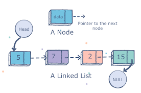
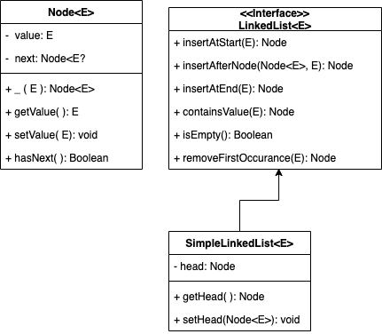

# What is a Linked List?

Linked List is nothing but a collection of elements called Nodes. It’s that simple!!

A node is a very simple object with just two properties. A variable to store data and another variable to store the memory address of the next node in the list. If you look at the below image, each node contains a data known as a key and a pointer which points to the address of the successive node known as next. Head is a special name given to the first node of a list, while Tail is a special name given to the last node of a linked list.

A node only knows about what data it contains, and who its neighbour is.

What’s so special about linked list is that it is a linear data structure where the position of the node does not determine the location where it is stored in the memory. As I explained above, the memory location of the successive node is stored in the current node. Which means that Linked Lists are dynamic — you can add or remove nodes from your linked list while your program is running.

## Linear Data Structures

A linear data structure traverses the data elements sequentially, in which only one data element can directly be reached. In other words, you can travel along a linear data structure in one direction by accessing each element one by one — nodes in linked lists.

Let’s summarize what we have learned up to now.

### Summary
* Elements in a linked list are known as nodes.
* Each node contains a data(key) and a pointer to its successor node, known as next.
* The attribute named head points to the first element of the linked list.
* The last element of the linked list is known as the tail.**

## Lets Build One

